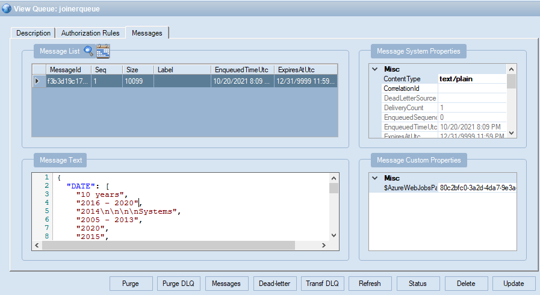

# New Joiner Challenge

<!-- TOC depthFrom:2 orderedList:true -->
- [New Joiner Challenge](#new-joiner-challenge)
  - [Project Description](#project-description)
  - [Preconditions](#preconditions)
  - [Architecture Design](#architecture-design)
    - [Technology Stack](#technology-stack)
    - [Components Description](#components-description)
      - [Resource Groups](#resource-groups)
      - [Azure Functions](#azure-functions)
    - [Solution Flow](#solution-flow)
      - [Upload Joiner Profile](#upload-joiner-profile)
      - [Create New Joiner](#create-new-joiner)
      - [Get List of Joiners](#get-list-of-joiners)
      - [Update Joiner](#update-joiner)
    - [Data Model](#data-model)
  - [Reporting Service Description](#reporting-service-description)

## Project Description

This project aims to create, register and manage some of the tasks that a new company joiner should work on.

## Preconditions

- Input file only in PDF or DOCX format.
- Use an Event-Driven Architecture approach.
- Build an approach based on four services with a specific responsibility.
- Each service should be created with a different programming language.
- Software components are deployed over an Microsoft Azure subscription

## Architecture Design


### Technology Stack

- [Python](https://www.python.org)
  - [Spacy](https://spacy.io)
- [Golang](https://golang.org)
- [NodeJS](https://nodejs.org/en/)
- [Microsoft Azure](https://azure.microsoft.com/en-us/)
  - [Azure Functions](https://azure.microsoft.com/en-us/services/functions/)
  - [Azure Service Bus](https://docs.microsoft.com/en-us/azure/service-bus-messaging/service-bus-messaging-overview)
  - [Azure SQL Server](https://azure.microsoft.com/en-us/products/azure-sql/database/)
  - [Azure Cosmos DB](https://docs.microsoft.com/en-us/azure/cosmos-db/introduction).

### Components Description

#### Resource Groups

Refers to: [Resource Groups](./doc/az-resource-groups.md)

#### Azure Functions

- Azure Function 1: File Upload and NLP Microservice. [Link](./doc/az-function-python-deployment.md)

```
project
│   .funcignore
│   .gitignore
│   host.json
|   local.settings.json
|   proxies.json
|   requirements.txt
|
└───NewJoinerReceiverFunction
│   │   __init__.py
│   │   function.json
|   |   sample.dat 
│   │   
│   
└───.vscode
    │   extensions.json
    │   launch.json
    |   settings.json
    |   tasks.json
```

**Endpoint**: Action POST

```bash
{baseUrl}/api/Joiner
```

**form-data**:

```bash
--form 'file=@"../../Profile_Test.docx"'
```

**Response body (Sample)**:
**Status Code**: OK

```bash
OK
```

- Stack: [Python + Spacy](./doc/az-function-python-deployment.md): Resulting message based on Natural Language Processing results

```json
{
  "DATE": [
    "June 2016 – September 2017",
    "October 2014 – June 2016",
    "October 2013 – October 2014",
    "June 2011 –",
    "October 2013",
    "May 2010 – June 2011"
  ],
  "GPE": [
    "US",
    "the United States",
    "UK"
  ],
  "LANGUAGE": [
    "Spanish",
    "English"
  ],
  "LOC": [
    "Latin America"
  ],
  "NORP": [
    "Brazilian"
  ],
  "Noun_Phrase": [
    "Professional Resume",
    "Name",
    "Name 1",
    "Role",
    "Developer",
    "Systems Engineer",
    "master",
    "Scrum Master",
    "software engineering",
    "experience",
    "software development",
    "enterprise and cloud-based applications",
    "Microsoft Azure",
    "Amazon Web Services",
    "Net Framework",
    "Net Core"    
  ],
  "ORG": [
    "Microsoft",
    "Amazon",
    "Azure",
    "AWS",
    "Endava"
  ],
  "PERSON": [
    "Name 1"
  ],
  "PRODUCT": [
    "Azure Virtual Machines"
  ],
  "Verb": [
    "specialize",
    "focus",
    "base",
    "support",
    "relate",
    "follow",
    "drive",
    "have",
    "execute",
    "acquire",
    "develop",
    "learn",
    "work",
    "adapt",
    "like",
    "bring",
    "promote",
    "certify",
    "improve",
    "provide",
    "use",
    "store",
    "serve",
    "communicate",
    "monitor",
    "generate",
    "deploy",
    "schedule",
    "extract",
    "identify"
  ]
}
```

- Message Queue result



- Azure Function 2: Joiner Microservice. [Link](./doc/az-function-golang-deployment.md)
  - Stack: Golang

**Operation**: GET Joiners

```
project
│   .env
│   .funcignore
│   .gitignore
|   go.mod
|   go.sum
|   handler.go
|   host.json
|   local.settings.json
|   proxies.json
|
└───NewJoinerFunction
│   │   function.json
│   │   
│   
└───func
│   └───dataaccess
│       │   joinerdataaccess.go
│       │   
│ 
└───.vscode
    │   extensions.json
    |   settings.json
    |   tasks.json
```

**Endpoint**: Action GET

```bash
{baseUrl}/api/Joiner
```

**Response body (Sample)**:
**Status Code**: OK

```json
[
    {
        "Id": 1,
        "Name": "Name 1",
        "Stack": "[\"Python\", \"Java\", \"Scala\",\"Akka\",\"ScalaTest\",\"BlueMix\",\"MqLite\",\"Cloudant\",\"Windows\",\"Spring\",\"Hibernate\",\"Eclipse\",\"Maven\",\"Tomcat\"]",
        "Role": "Developer",
        "Languages": "[\"Romanian\",\"Russian\",\"English\",\"French\"]"
    },
    {
        "Id": 2,
        "Name": "Name 2",
        "Stack": "[\"Azure SQL Azure\",\"Azure Cosmos DB\",\"Azure Virtual Machines\",\"Bizagi Cloud\",\"BPM Bizagi\"]",
        "Role": "Senior Developer",
        "Languages": "[\"Spanish\",\"English\"]"
    },
    {
        "Id": 3,
        "Name": "Name 3",
        "Stack": "[\"Azure Virtual Machines\",\"BPM Bizagi\"]",
        "Role": "Developer",
        "Languages": "[\"Spanish\",\"English\"]"
    },
    {
        "Id": 4,
        "Name": "Name 4",
        "Stack": "[\"Azure Virtual Machines\",\"Bizagi Cloud\",\"BPM Bizagi\"]",
        "Role": "UX Developer",
        "Languages": "[\"Spanish\",\"English\"]"
    }
]
```

**Operation**: GET Joiner

```
project
│   .env
│   .funcignore
│   .gitignore
|   go.mod
|   go.sum
|   handler.go
|   host.json
|   local.settings.json
|   proxies.json
|
└───NewJoinerByFunction
│   │   function.json
│   │   
│   
└───func
│   └───dataaccess
│       │   joinerdataaccess.go
│       │   
│ 
└───.vscode
    │   extensions.json
    |   settings.json
    |   tasks.json
```

**Endpoint**: Action GET

```bash
{baseUrl}/api/Joiner?id=1
```

**Response body (Sample)**:
**Status Code**: OK

```json
{
        "Id": 1,
        "Name": "Name 1",
        "Stack": "[\"Python\", \"Java\", \"Scala\",\"Akka\",\"ScalaTest\",\"BlueMix\",\"MqLite\",\"Cloudant\",\"Windows\",\"Spring\",\"Hibernate\",\"Eclipse\",\"Maven\",\"Tomcat\"]",
        "Role": "Developer",
        "Languages": "[\"Romanian\",\"Russian\",\"English\",\"French\"]"
}
```

**Operation**: PUT Joiner

```
project
│   .env
│   .funcignore
│   .gitignore
|   go.mod
|   go.sum
|   handler.go
|   host.json
|   local.settings.json
|   proxies.json
|
└───NewJoinerUpdateFunction
│   │   function.json
│   │   
│   
└───func
│   └───dataaccess
│       │   joinerdataaccess.go
│       │   
│ 
└───.vscode
    │   extensions.json
    |   settings.json
    |   tasks.json
```

**Endpoint**: Action PUT

```bash
{baseUrl}/api/Joiner?id=1
```

**Request body (Example)**:

```json
{	
	"name": "Name 1",
	"stack": "[\"Python\", \"Scala\",\"Akka\",\"ScalaTest\",\"BlueMix\",\"MqLite\",\"Cloudant\",\"Windows\",\"Spring\",\"Hibernate\",\"Eclipse\",\"Maven\",\"Tomcat\"]",
	"role": "Developer",
	"languages": "[\"Romanian\",\"Russian\",\"English\",\"French\"]"
}
```

**Response body (Sample)**:
**Status Code**: OK

```json
{
  "Id": 1,
  "Name": "Name 1",
  "Stack": "[\"Python\", \"Scala\",\"Akka\",\"ScalaTest\",\"BlueMix\",\"MqLite\",\"Cloudant\",\"Windows\",\"Spring\",\"Hibernate\",\"Eclipse\",\"Maven\",\"Tomcat\"]",
  "Role": "Developer",
  "Languages": "[\"Romanian\",\"Russian\",\"English\",\"French\"]"
}
```

- Azure Function 3: Task Microservice. [Link](./doc/az-function-nodejs-deployment.md)
  - Stack: NodeJS

**Operation**: GET/POST Tasks

```
project
│   node_modules
│   .env
│   .funcignore
|   .gitignore
|   child.js
|   dboperations.js
|   host.json
|   local.settings.json
|   package-lock.json
|   package.json
|   task.js
|
└───NewJoinerTaskFunction
│   │   function.json
|   |   index.js
|   |   sample.dat
│   │   
│ 
└───.vscode
    │   extensions.json
    |   settings.json
    |   tasks.json
    |   launch.json
```

**Endpoint**: Action GET

```bash
{baseUrl}/api/Task
```
**Response body (Sample)**:
**Status Code**: OK

```json
[
    {
        "Id": 1,
        "Name": "Analyse Requirement",
        "Description": "Lorem ipsum dolor sit amet, consectetur adipiscing elit, sed do eiusmod tempor incididunt ut labore et dolore magna aliqua",
        "EstimatedRequiredHours": 1,
        "Stack": "--",
        "MinRole": "BA",
        "Task": {
            "Id": 2,
            "Name": "Create Code Component",
            "Description": "Lorem ipsum dolor sit amet, consectetur adipiscing elit, sed do eiusmod tempor incididunt ut labore et dolore magna aliqua",
            "EstimatedRequiredHours": 3,
            "Stack": ".Net",
            "MinRole": "Developer"
        }
    },
    {
        "Id": 7,
        "Name": "Run Tests",
        "Description": "Lorem ipsum dolor sit amet, consectetur adipiscing elit, sed do eiusmod tempor incididunt ut labore et dolore magna aliqua",
        "EstimatedRequiredHours": 1,
        "Stack": "--",
        "MinRole": "BA",
        "Task": {
            "Id": 8,
            "Name": "Create Code Component",
            "Description": "Lorem ipsum dolor sit amet, consectetur adipiscing elit, sed do eiusmod tempor incididunt ut labore et dolore magna aliqua",
            "EstimatedRequiredHours": 2,
            "Stack": ".Net",
            "MinRole": "Developer"
        }
    },
    {
        "Id": 3,
        "Name": "Run Tests",
        "Description": "Lorem ipsum dolor sit amet, consectetur adipiscing elit, sed do eiusmod tempor incididunt ut labore et dolore magna aliqua",
        "EstimatedRequiredHours": 1,
        "Stack": "--",
        "MinRole": "BA",
        "Task": null
    }
]
```

**Endpoint**: Action POST

```bash
{baseUrl}/api/Task
```

**Request body (Example)**:

```json
{        
        "Name": "Run Tests",
        "Description": "Lorem ipsum dolor sit amet, consectetur adipiscing elit, sed do eiusmod tempor incididunt ut labore et dolore magna aliqua",
        "EstimatedRequiredHours": 1,
        "Stack": "--",
        "MinRole": "BA",
        "Task": {            
            "Name": "Create Code Component",
            "Description": "Lorem ipsum dolor sit amet, consectetur adipiscing elit, sed do eiusmod tempor incididunt ut labore et dolore magna aliqua",
            "EstimatedRequiredHours": 2,
            "Stack": ".Net",
            "MinRole": "Developer"
        }
    }
```

**Response Status Code**: Created

**Operation**: GET Task

```
project
│   node_modules
│   .env
│   .funcignore
|   .gitignore
|   child.js
|   dboperations.js
|   host.json
|   local.settings.json
|   package-lock.json
|   package.json
|   task.js
|
└───NewJoinerTaskGetByFunction
│   │   function.json
|   |   index.js
|   |   sample.dat
│   │   
│ 
└───.vscode
    │   extensions.json
    |   settings.json
    |   tasks.json
    |   launch.json
```

**Endpoint**: Action GET

```bash
{baseUrl}/api/Task/1
```
**Response body (Sample)**:
**Status Code**: OK

```json
{
    "Id": 1,
    "Name": "Analyse Requirement",
    "Description": "Lorem ipsum dolor sit amet, consectetur adipiscing elit, sed do eiusmod tempor incididunt ut labore et dolore magna aliqua",
    "EstimatedRequiredHours": 1,
    "Stack": "--",
    "MinRole": "BA",
    "Task": {
        "Id": 2,
        "Name": "Create Code Component",
        "Description": "Lorem ipsum dolor sit amet, consectetur adipiscing elit, sed do eiusmod tempor incididunt ut labore et dolore magna aliqua",
        "EstimatedRequiredHours": 3,
        "Stack": ".Net",
        "MinRole": "Developer"
    }
}
```

**Operation**: PUT/DELETE Task

```
project
│   node_modules
│   .env
│   .funcignore
|   .gitignore
|   dboperations.js
|   host.json
|   local.settings.json
|   package-lock.json
|   package.json
|   joinerservice.js
|
└───NewJoinerTaskPutDeleteFunction
│   │   function.json
|   |   index.js
|   |   sample.dat
│   │   
│ 
└───.vscode
    │   extensions.json
    |   settings.json
    |   tasks.json
    |   launch.json
```

**Endpoint**: Action PUT

```bash
{baseUrl}/api/Task/1
```

**Request body (Example)**:

```json
{        
    "Name": "Create Code Component",
    "Description": "Lorem ipsum dolor sit amet, consectetur adipiscing elit, sed do eiusmod tempor incididunt ut labore et dolore magna aliqua",
    "EstimatedRequiredHours": 3,
    "Stack": ".Net",
    "MinRole": "Developer",
    "TaskId": 1,
    "UserId": 1
}
```

> Optional: TaskId and UserId

**Response Status Code**: OK

```json
{
    "message": "Successfully updated"
}
```

**Endpoint**: Action DELETE

```bash
{baseUrl}/api/Task/1
```

**Response Status Code**: OK

```json
{
    "message": "Successfully deleted"
}
```

Refers to: [Postman Collection](./doc/new_joiners.postman_collection.json)

**Operation**: Message broker.

Refers to: [Service Bus Queue](./doc/az-service_bus_namespace.md)

### Solution Flow

#### Upload Joiner Profile


#### Create New Joiner


#### Get List of Joiners


#### Update Joiner


### Data Model


**Joiner**: `Joiner`

| Column Name | Type | Sample |  
|-----------|:-----------:|:-----------|  
| Id | int | 1 |
| Name | varchar | Camilo Robles |
| Stack | varchar | ["Python", "Java", "Scala"] |  
| Role | varchar | Developer |
| Languages | varchar | ["Spanish","English"] |
| JoinerMessageAcknowledgementId | int | 300 |

**Joiner Message Acknowledgement**: `JoinerMessageAcknowledgement`

| Column Name | Type | Sample |  
|-----------|:-----------:|:-----------|  
| Id | int | 11 |
| CreatedDate | varchar | 2021-10-11 19:26:12.000 |
| Status | varchar | Complete |  
| Message | varchar | {"DATE": ["2011-2014", "February 2015 |

**Task**: `Task`

| Column Name | Type | Sample |  
|-----------|:-----------:|:-----------|  
| Id | int | 1 |
| Name | varchar | Create Code Component |
| Description | varchar | Lorem ipsum dolor sit |  
| EstimatedRequiredHours | varchar | 2 |
| Stack | varchar | .Net |
| MinRole | varchar | Developer |
| TaskId | int | 2 |
| UserId | int | 1 |

## Reporting Service Description

Refers to: [Reporting](./doc/az-function_reporting.md)
